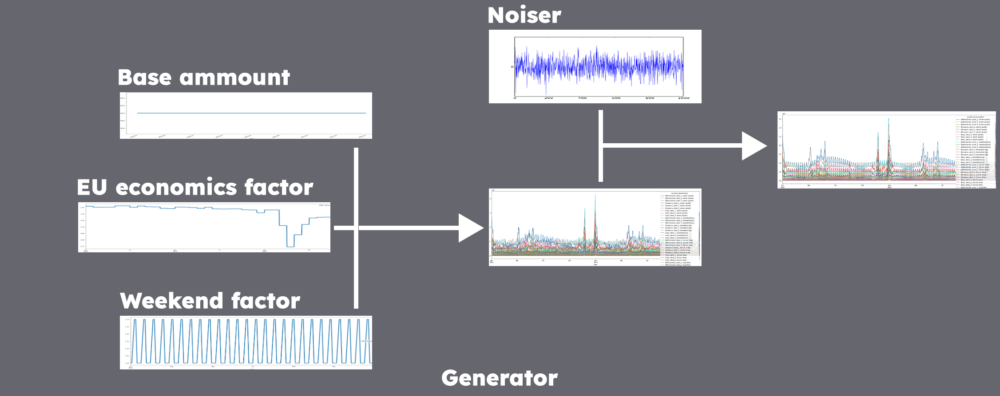
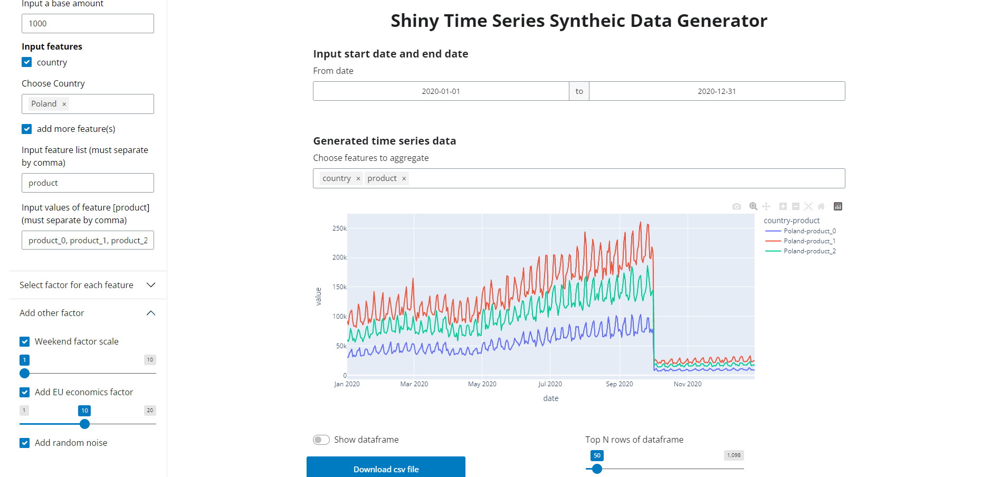

# timeseries-generator
This repository consists of a python packages that generates synthetic time series dataset in a generic way (under `/timeseries_generator`) and demo notebooks on how to generate synthetic timeseries data. The goal here is to have non-sensitive data available to demo solutions and test the effectiveness of those solutions and/or algorithms. In order to test your algorithm, you want to have time series available containing different kinds of trends. The python package should help create different kinds of time series while still being maintainable.

## `timeseries_generator` package


This package i based on code from repository [timeseries-generator](https://github.com/Nike-Inc/timeseries-generator?tab=readme-ov-file), it is assumed that a time series is composed of a base value multiplied by many factors.
```
ts = base_value * factor1 * factor2 * ... * factorN + Noiser
```



These factors can be anything, random noise, linear trends, to seasonality. The factors can affect different features. For example, some features in your time series may have a seasonal component, while others do not.

Different factors are represented in different classes, which inherit from the `BaseFactor` class. Factor classes are input for the `Generator` class, which creates a dataframe containing the features, base value, all the different factors working on the base value and and the final factor and value.

### Core concept
- **Generator**: a python class to generate the time series. A generator contains a list of factors and noiser. By overlaying the factors and noiser, generator can produce a customized time series
- **Factor**: a python class to generate the trend, seasonality, holiday factors, etc. Factors take effect by multiplying on the base value of the generator.
- **Noised**: a python class to generate time series noise data. Noiser take effect by summing on top of "factorized" time series.
This formula describes the concepts we talk above

### Built-in Factors
- **LinearTrend**: give a linear trend based on the input slope and intercept
- **EUEcoTrendComponents**: give a monthly changed factor based on EU industry product public data
- **WeekendTrendComponents**: more sales at weekends than on weekdays
- **FeatureRandFactorComponents**: set up different sale amount for different stores and different product


## Installation
```sh
pip install -r ./Shiny-timeseries-generator/requirements.txt
```

## Web based prototyping UI
I also use [Shiny for Python](https://shiny.posit.co/py/) to build a web-based UI to demonstrate how to use this package to generate synthesis time series data in an interactive web UI.
``` sh
shiny run --reload --launch-browser ./Shiny-timeseries-generator/app.py
```



## License
This package is released under the [Apache License, Version 2.0](http://www.apache.org/licenses/LICENSE-2.0)
